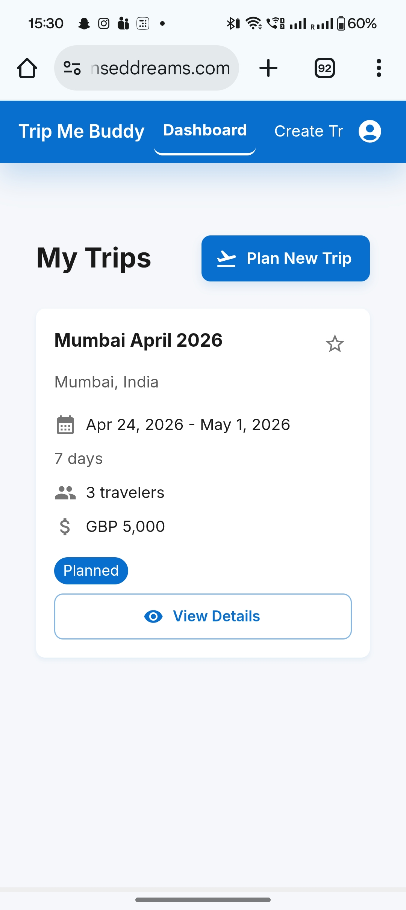

# Trip Me Buddy - AI-Powered Travel Planning Platform

An enterprise-grade MVP of a web-application showcasing modern cloud architecture, application of agentic AI framework, and industrial best practices for user security and scalability.

<figure align="center">

<figcaption><b>Figure 1: </b>Desktop Login Page </figcaption>
</figure>

<figure align="center">

<figcaption><b>Figure 2: </b>Desktop Dashboard Page </figcaption>
</figure>

<figure align="center">

<figcaption><b>Figure 3: </b>Desktop Create Trip Page </figcaption>
</figure>

<figure align="center">

<figcaption><b>Figure 4: </b>Mobile Dashboard Page </figcaption>
</figure>

<figure align="center">

<figcaption><b>Figure 5: </b>Mobile Trip Details Page - Summary </figcaption>
</figure>

<figure align="center">

<figcaption><b>Figure 6: </b>Mobile Trip Details Page - Research </figcaption>
</figure>

<figure align="center">

<figcaption><b>Figure 7: </b>Mobile Trip Details Page - Budget Breakdown </figcaption>
</figure>

<figure align="center">

<figcaption><b>Figure 8: </b>Mobile Trip Details Page - Flights and Hotels </figcaption>
</figure>

[Live App Link](https://tripmebuddy.senseddreams.com/) (Service will be paused on 30-Mar-2026 and will be started on request in a 24h period for a 24h period.)

## Project Purpose
TripMeBuddy is a learning and upskilling project, not a commercial finished product. The platform is built to demonstrate hands-on skills in the following:
- Advanced AI Integration: Multi-agent systems using LangGraph for orchestrated trip planning workflows.
- Enterprise Cloud Architecture: Production ready AWS infrastructure.
- Full-stack Development: Modern React Frontend and a FastAPI Backend, with Data Layer leveraging RDS and Infrastructure using ECS/Fargate
- DevOps Best Practices: IaC, containerization, and CI/CD pipelines for deployment, rollback, versioning leveraging GitHub Actions.
- Security Implementation: OAuth2.0 authentication; data encryption; and cloud security protocols observed via implementation of VPC subnets and firewalls.

### A Simple User Guide
1. Signup: Create an account using the Signup page (accessible via the Signup button on the landing page - login page)
2. Login: Once the credentials are created via Signup, use those to login, to reach your personalized Dashboard screen.
3. Navigate: Click on "Plan New Trip" button or navigate to the "Create Trip" page using the navigation pane at the top.
4. Create a Trip: In the free text field, enter your requirements. For best results, ensure the following facets of requirements are entered (Note that it being a learning project and not a funded product, it focuses on saving costs and therefore the search utility used only contains Flights and Hotels data for locations with major international airports):
   1. Mention your starting point
   2. Mention your destination.
   3. Mention the date of travel and the date of return in a format which if extracted using AI, cannot be mistaked for another data due to difference in American and European date formats. dd-mmm-YYYY is recommended but the extraction logic can handle a wide variety of formats including n-day durations.
   4. Specify the number of travelers. "I will be travelling with my 2 friends" or "Me and my wife and 2 kids will be taking this trip".
   5. Specify your budget and the budget currency. The tool maintains an FX Rates table internally, updated at regular intervals to convert results into the currency you selected.
   6. Provide your preferences. "I like sunsets, photography, and learning about local history." or "I am a vegetarian but would like to explore the local cuisine."
   7. Click on "Plan My Trip".
5. Trip Planning Progress: Wait for the AI agents to extract essential information required to plan the trip from your inputs, perform a search, call the right API endpoints, curate the results, build an itinerary based on your preferences, and push them to the frontend in an appealing format. Takes between 30 to 90 seconds.
6. Trip Details: View your trip details. If the destination chosen doesn't have an international airport, the nearest airport destination matching the specifications will be selected via a fallback mechanism.
7. "Edit" or "Delete": Changed your mind about a trip? Delete it and plan another, or simply update the one planned already by filling out the details in the Edit Trip modal.
8. Dashboard: Head to the dashboard page via the "back" button provided or by using the navigation pane. View all trips planned so far with basic details about each one. Select any trip on the Dashboard to view its complete details.

**DISCLAIMER**
This is a demo project for my learnings and to create something mildly cool. So,
- verify the details from other sources before booking.
- prices and availability depend on the free data source used and may differ in reality.
- you can plan a trip here but will have to book the tickets and hotels elsewhere (at least for now)
- Works with only one start and end destination but with more data about local travel options such as buses, ferries, trains and more, a multi-destination trip planning will soon be implemented (if this MVP seems worthwhile to enough people).

## Tech Specifications and Development Details
*For those interested in how the tool was developed, in knowing what I can help create, or in helping me understand what could be improved.*

**Backend Development**

- Python/FastAPI for high-performance async APIs
- Multi-agent AI orchestration using LangGraph
- RESTful API design with OpenAPI documentation
- Async/await patterns for scalable concurrent processing
- Integration with third-party APIs (Amadeus, Google Gemini AI)

**Frontend Development**

- React 18 with TypeScript for type-safe development
- Material-UI for professional component design
Real-time updates via Server-Sent Events (SSE)
- State management and context patterns
- Responsive design for mobile/desktop

**Cloud Architecture (AWS)**

- Compute: ECS Fargate for containerized applications
- Database: RDS PostgreSQL with read replicas
- Caching: ElastiCache Redis for session management
- CDN: CloudFront for global content delivery
- Networking: VPC, subnets, security groups, ALB
- Storage: S3 for static assets
- DNS: Route 53 for domain management
- Security: ACM for SSL/TLS certificates

**Infrastructure & DevOps**

- Infrastructure as Code using Terraform
- Docker containerization for consistent environments
- Multi-environment deployment (dev/staging/prod)
- CloudWatch monitoring and logging
- Automated deployment pipelines

**Security & Authentication**

- OAuth 2.0 / OpenID Connect via Keycloak
- JWT token-based authentication
- HTTPS/TLS encryption
- Security groups and network isolation
- Secrets management

**AI/ML Integration**

- Google Gemini AI for destination research
- LangGraph for multi-agent workflow orchestration
- Amadeus API for real travel data
- Async job processing with real-time progress tracking

**Development Timeline**

- Duration: 12 weeks (~400 hours - 25 per weekend)
- Methodology: Agile with weekly milestones
- Testing: Automated unit tests, integration tests
- Documentation: Comprehensive technical and user docs

**Key Achievements:**

- Deployed production-ready application to AWS
- Implemented 5-agent AI system for trip planning
- Achieved 100% test coverage on authentication module
- Managed infrastructure across 12+ AWS services
- Built responsive frontend with real-time updates
- Integrated 3 external APIs (Amadeus, Gemini, Keycloak)

### Tech Stack
**Frontend**

- Framework: React 18.2 with TypeScript 5.0
- UI Library: Material-UI (MUI) 5.14
- State Management: React Context API
- Routing: React Router 6.16
- Build Tool: Vite 4.4
- HTTP Client: Axios
- Form Handling: React Hook Form + Zod validation

**Backend**

- Framework: FastAPI 0.104 (Python 3.11)
- ORM: SQLAlchemy 2.0 with async support
- Validation: Pydantic v2
- Authentication: Keycloak (OAuth 2.0 / OpenID Connect)
- Caching: Redis 7.2
- Task Queue: Background workers for async processing
- API Documentation: OpenAPI (Swagger UI)

**AI/ML**

- Orchestration: LangGraph 0.0.26 for multi-agent workflows
- LLM: Google Gemini AI (gemini-1.5-flash)
- Travel Data: Amadeus Self-Service API
- Currency: ExchangeRate-API for real-time conversion
- Agents: 5 specialized agents (Preferences, Research, Flights, Hotels, Itinerary)

**Infrastructure (AWS)**

- Compute: ECS Fargate (backend, Keycloak, workers)
- Database: RDS PostgreSQL 15
- Cache: ElastiCache Redis
- Load Balancer: Application Load Balancer (ALB)
- CDN: CloudFront
- Storage: S3 for static assets
- DNS: Route 53
- Certificates: ACM (AWS Certificate Manager)
- Networking: VPC with public/private subnets
- Monitoring: CloudWatch Logs & Metrics
- IaC: Terraform 1.6

**Development Tools**

- Version Control: Git + GitHub
- IDE: Cursor AI (VS Code fork)
- API Testing: Postman, pytest
- Containerization: Docker 24.0
- Code Quality: ESLint, Prettier, Black, MyPy
- Testing: pytest, Jest, React Testing Library

### High Level Architecture
<figure align="center">

<figcaption><b>Figure 9: </b>Request Flow Architecture Diagram</figcaption>
</figure>
<figure align="center">

<figcaption><b>Figure 10: </b>Agent Communication and Events Channel Job Workflow Diagram</figcaption>
</figure>
</figure>

### Future Scope
- User Acquisition
- Multi-destination trip planning with local transit data APIs integration
- Real-time checks for seating/room availability in presented travel and stay options
- Integration with travel booking platforms
- Mobile application development (iOS/Android)
- Enhanced AI models with user feedback feeding into its learning dataset
- Compliance Certifications (ISOXXXXX, PCI-DSS for Payments, etc.)
- Strategic partnerships with OTAs

## Architecture Overview

**Agent Responsibilities**

1. Preferences Analyzer: Extracts destination, budget, dates, traveler count
2. Destination Research: Uses Gemini AI for attractions, weather, local tips
3. Flight Search: Queries Amadeus for best flight options
4. Hotel Search: Finds accommodations via Amadeus
5. Itinerary Builder: Creates day-by-day schedule with budget allocation

**Why Multi-Agent?**

- Specialization: Each agent is optimized for specific tasks
- Reliability: Failure in one agent doesn't crash the entire workflow
- Testability: Individual agents can be tested and improved independently
- Scalability: Agents can run in parallel where possible

<pre>
bash
# 1. Clone the repository
git clone https://github.com/SwapDes/TripMeBuddy.git
cd TripMeBuddy

# 2. Setup backend
cd backend
python -m venv .venv
source .venv/bin/activate  # Windows: .venv\Scripts\activate
pip install -r requirements.txt
cp env.example .env  # Edit with your API keys

# 3. Setup frontend
cd ../frontend
npm install
cp .env.example .env  # Edit with backend URL

# 4. Start services (Docker Compose)
cd ..
docker-compose up -d  # Starts PostgreSQL, Redis, Keycloak

# 5. Run backend
cd backend
uvicorn app.main:app --reload

# 6. Run frontend (new terminal)
cd frontend
npm run dev

# 7. Access application
# Frontend: http://localhost:5173
# Backend API: http://localhost:8000/docs
# Keycloak: http://localhost:8080
</pre>

### Testing
Test Coverage:

- Authentication Module: 100% (11/11 tests passing)
- Integration Tests: 2 passing (module imports validated)
- Overall Backend: 30% coverage (focus on critical paths)

<pre>
bash
# Backend tests
cd backend
pytest -v

# Frontend tests
cd frontend
npm test

# With coverage
pytest --cov=app --cov-report=html
</pre>
Note: Some trip API tests require async database setup 
